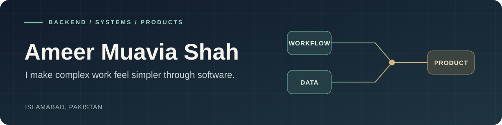

# Hi, I'm Ameer.

I’m a backend and product engineer in Islamabad, Pakistan. For more than five years, I’ve worked with **Frappe and ERPNext** to turn business processes into usable software. These days, I also build APIs and product foundations with **FastAPI, PostgreSQL, and React**.

I enjoy the part of engineering where a messy workflow becomes a clear data model, a dependable API, and a tool people can use without thinking about the machinery behind it.

[Portfolio](https://maveeshah.github.io/) · [LinkedIn](https://www.linkedin.com/in/ameer-muavia-shah/) · [Email](mailto:mavee.shah@hotmail.com) · [Public repositories](https://github.com/maveeshah?tab=repositories)

## Experience

| Area | What I've worked on |
| --- | --- |
| **ERP and business workflows** | Frappe/ERPNext customizations, purchasing tools, operational workflows, and integrations shaped around how teams work. |
| **Reporting and data operations** | Dynamic reports for warehouse data, Excel generation, and import/export automation. |
| **Notifications and automation** | Configurable notification flows with email and in-app delivery, plus tools that remove repetitive steps. |
| **Product backends** | FastAPI services, PostgreSQL data models, APIs, and shared foundations for web and mobile applications. |

## Ventures I'm building

Alongside my engineering work, I'm building products around education, commerce, privacy, and household finance. Each is at a different stage of development.

| Venture | What I'm building |
| --- | --- |
| **Aangan** | Branded academy software for independent educators, covering classes, attendance, fees, and the day-to-day work of teaching. |
| **Raha** | A private shared space for couples to keep memories and coordinate everyday care, designed around end-to-end encryption. |
| **Qaisariyah** | Storefront software that helps sellers present their brand, manage orders, and keep their customer relationships. |
| **Tazkiyah Finance** | A household finance app built around envelope budgeting, accounts, transaction history, and savings goals. |

## Skills

| Skill area | Tools and approach |
| --- | --- |
| **ERP engineering** | Frappe, ERPNext, Python, JavaScript; custom workflows, reports, notifications, and data imports. |
| **Backend and APIs** | FastAPI, REST, service design, integrations, validation, and access control. |
| **Data** | PostgreSQL, SQL, Redis; relational modeling, reporting, and data integrity. |
| **Web and delivery** | React, Docker, Git; interfaces that connect cleanly to backend services. |

## Work you can explore

- [**Supplier Item Picker**](https://github.com/maveeshah/supplier_item_picker) — a Frappe utility for adding multiple items from a selected supplier.
- [**Danisa**](https://github.com/maveeshah/Danisa) — a public repository of Frappe/ERPNext customizations.
- [**Salla integration**](https://github.com/maveeshah/salla_integ) — integration work in a Frappe app.

## A little more about me

Outside work, I like chess, story-driven anime, and the Honda Accord CL9. I’m interested in software that stays useful as the people and businesses behind it grow.

**Have a workflow that needs untangling?** [Get in touch](mailto:mavee.shah@hotmail.com).
